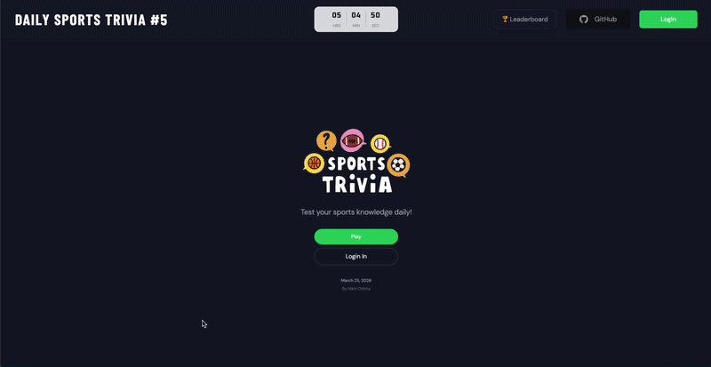
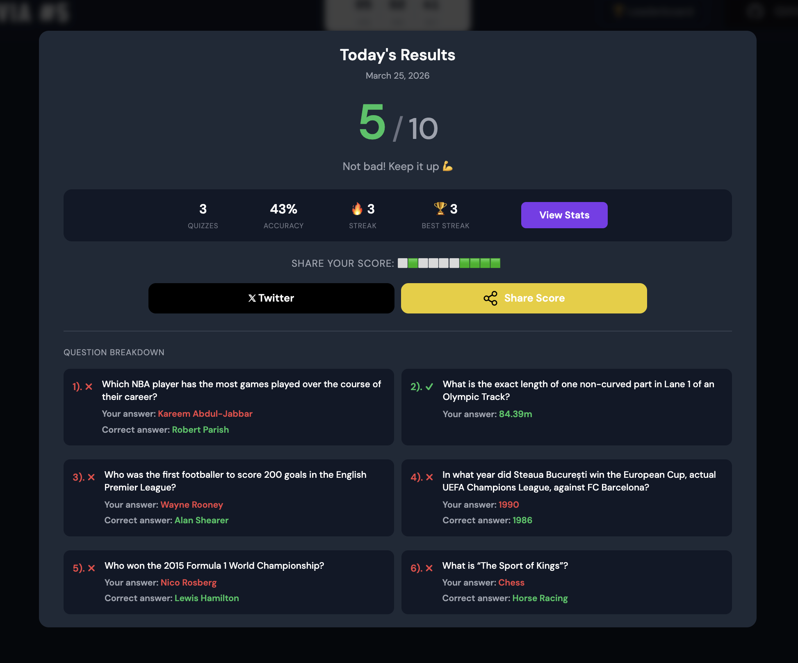
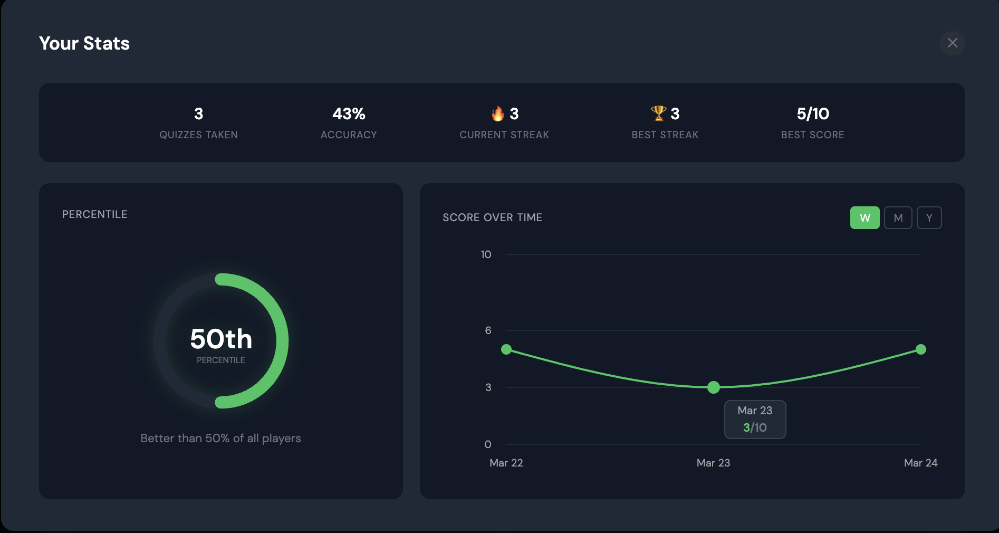
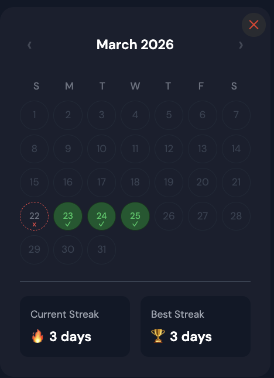

# 🏆 Daily Sports Trivia

[](https://daily-sports-trivia.com)
[](LICENSE)
[](https://react.dev)
[](https://nodejs.org)
[](https://daily-sports-trivia.com)

> Think you know sports? One quiz. Every day. Test your knowledge.

**[▶ Play today's quiz](https://daily-sports-trivia.com)**



---

## 🌟 Highlights

- 🗓️ A brand new 10-question quiz drops every day at midnight — same questions, every player, worldwide
- 🔥 Track your daily streak with a calendar heatmap — don't break the chain
- 📊 Personal stats: accuracy %, percentile ring, and a score-over-time chart
- 🏅 Leaderboard ranking against other registered players
- 📤 Share your result as a Wordle-style emoji grid
- 🔐 Sign in with Google or create an account with email and password
- ⏱️ Live countdown to the next quiz reset

---

## ℹ️ Overview

Daily Sports Trivia delivers one fresh 10-question sports quiz per day — automatically fetched, stored, and served to every player worldwide at midnight. Questions span easy, medium, and hard difficulty across all major sports.

Play as a guest or create an account to track your streak, compare your score against other players, and dig into your personal stats.

### 👤 Author

Built by [Nikit Chhita](https://github.com/NikitChhita) — full-stack, solo, from database schema to cloud deployment.

---

## 🚀 Screens of the website








---

## 🛠️ Built with

**Frontend** — React 18, Vite, shadcn/ui, Tailwind CSS, Recharts

**Backend** — Node.js, Express, Sequelize ORM, Passport.js, JWT, node-cron

**Database** — MySQL 8 on AWS RDS

**Auth** — Google OAuth 2.0 + bcrypt email/password

**Infrastructure** — AWS EC2 · RDS · S3 · CloudFront

---

## ⬇️ Run locally

Requires **Node.js 20+** and **MySQL 8**.

```bash
git clone https://github.com/NikitChhita/daily-sports-trivia.git
cd daily-sports-trivia
```

```bash
# Backend
cd backend && npm install
cp .env.example .env   # fill in your info
npm run dev
```

```bash
# Frontend
cd frontend && npm install
npm run dev
```

Open [http://localhost:5173](http://localhost:5173).

---

## 💭 Feedback

Found a bug or want to request a feature? [Open an issue](https://github.com/NikitChhita/daily-sports-trivia/issues) — all feedback is welcome.
